# Advanced RAG Agent for Blockchain Anomaly Detection

## 1. Introduction

This repository serves as a **Proof-of-Concept (PoC)** environment for an advanced **Retrieval-Augmented Generation (RAG)** architecture, specifically designed for blockchain anomaly detection.

This is not just a standard RAG chatbot. The system is built as an intelligent **Agent** capable of making decisions and utilizing a variety of tools—from querying an internal knowledge base and performing real-time web searches to interacting with specialized blockchain analysis services.

***⚠️ CAUTION: THE goal of this repository is to experiment, refine, and document core architectural decisions before applying them to the MAIN PROJECT -->  <---.**

## 2. Core Design Philosophy

Every technical decision in this project adheres to four foundational philosophies:

*   **Transparency & Control:** Prioritizing custom-written core logic to understand every processing step. Avoiding "black boxes" or unnecessarily complex abstractions.
*   **Modularity & Scalability:** Designing components independently for easy replacement, upgrades, and the addition of new tools.
*   **Production Readiness:** Always considering stability, observability, and security in every decision (e.g., choosing Qdrant, implementing structured logging).
*   **Resource Optimization:** Using efficient tools and techniques (e.g., quantized models, high-performance vector databases) to suit resource-constrained environments.

## 3. System Architecture

The architecture is divided into two main flows: an **Offline Ingestion** flow for processing and vectorizing data, and an **Online Inference** flow where the Agent handles user requests in real-time.

```mermaid
%%{init: {
  "theme": "base",
  "themeVariables": {
    "fontFamily": "Inter, Arial, sans-serif",
    "fontSize": "16px",
    "primaryColor": "#e5faff",
    "primaryBorderColor": "#1464e4",
    "lineColor": "#1464e4",
    "edgeLabelBackground": "#ffffff"
  },
  "flowchart": {
    "htmlLabels": false,
    "curve": "basis",
    "rankSpacing": 60,
    "nodeSpacing": 60,
    "diagramPadding": 20,
    "subGraphTitleMargin": { "top": 30, "bottom": 20 }
  },
  "arrowMarkerAbsolute": true
}}%%
flowchart LR
  classDef offline fill:#fff4e6,stroke:#e47614,stroke-width:2px;
  classDef online fill:#e6f5ff,stroke:#1464e4,stroke-width:2px;
  classDef data fill:#fffaf0,stroke:#ff8c00,stroke-width:2px;
  classDef api fill:#e6ffed,stroke:#14a33a,stroke-width:2px;

  subgraph "① Luồng Offline: Ingestion Pipeline"
    A1["Dữ liệu thô:<br/>• .md<br/>• .csv"]:::data --> A2["Ingestion Script<br/>scripts/ingest_data.py"]:::offline
    A2 --> A3{"Chunking (LangChain)"}:::offline
    A3 --> A4{"Embedding (SentenceTransformer)"}:::offline
    A4 --> A5["Kho Vector<br/>Qdrant Server"]:::data
  end

  subgraph "② Luồng Online: Real‑time Inference (Agent‑based)"
    B1["👤 User"]:::online --> B2["🔧 Backend API<br/>FastAPI"]:::online

    subgraph "Container: Backend"
      B2 --> B4{"🤖 Agent Service<br/>(Router‑Executor‑Synthesizer)"}:::online
      B4 -- "1. Router quyết định" --> B4_Executor{"🛠️ Executor<br/>(Thực thi công cụ)"}:::online
    end

    B4_Executor -- "Chọn Knowledge Base" --> B5{"Embedding<br/>(SentenceTransformer)"}:::online
    B4_Executor -- "Chọn Anomaly Detector" --> C1["📈 Anomaly Detection API"]:::api
    B4_Executor -- "Chọn Graph Handler" --> C2["🕸️ Graph Handling API"]:::api
    B4_Executor -- "Chọn Web Search" --> C3["🌐 Web Search API<br/>(DuckDuckGo)"]:::api

    B5 --> A5
    A5 --> B_Context["📝 Tool Output / Context"]:::data
    C1 --> B_Context
    C2 --> B_Context
    C3 --> B_Context

    B_Context --> B6["🧠 LLM Client (Synthesizer)<br/>LangChain"]:::online
    B6 --> B7["🌐 host.docker.internal:11434"]:::online

    subgraph "Máy Host"
      B7 --> B8["⚙️ LLM Server<br/>Ollama"]:::online
    end

    B7 <--> B8
    B6 -. "3. Token stream" .-> B2
  end

  linkStyle default stroke:#1464e4,stroke-width:3px;

```



## 4. Tech Stack

| Area                 | Technology                                                                                                                             |
| -------------------- | -------------------------------------------------------------------------------------------------------------------------------------- |
| **Backend**          |                                   |
| **LLM Serving**      |                                      |
| **Vector Database**  |                                      |
| **Orchestration**    |                                                         |
| **Models**           |  (SentenceTransformer, Cross-Encoder) |
| **Containerization** |                                     |
| **Logging**          |                                                         |

## 5. Setup and Launch

### **Prerequisites**
*   [Git](https://git-scm.com/)
*   [Docker](https://www.docker.com/) and [Docker Compose](https://docs.docker.com/compose/)
*   [Ollama](https://ollama.com/) installed and running on the host machine.

### **Step 1: Install Ollama and Pull the Model**
Ensure Ollama is running on your machine. Then, pull the LLM used in this project:
```bash
ollama pull llama3:8b-instruct-q4_K_M
```

### **Step 2: Clone the Repository**
```bash
git clone <your-repository-url>
cd <your-repository-name>
```

### **Step 3: Configure the Environment**
Create a `.env` file from the example template.
```bash
cp .env.example .env
```
Open the `.env` file and fill in any necessary values (e.g., API keys for external services).

### **Step 4: Build and Launch the Containers**
Use Docker Compose to build the image and launch the services (FastAPI backend and Qdrant).
```bash
# Build the image to install dependencies and update source code
docker-compose build

# Launch services in detached mode
docker-compose up -d
```
To view the backend logs:
```bash
docker-compose logs -f backend
```

### **Step 5: Ingest Data (First-time setup only)**
Run the ingestion script to process and load data into the Qdrant vector database.
```bash
docker-compose exec backend python -m scripts.ingest_data
```

## 6. Usage

Once the server is running, you can interact with the API via the `/api/v1/chat` endpoint.

**Example: Checking the risk of an address**
Use `curl` to send a request. (Note: on Windows, you may need to escape the inner double quotes).
```bash
curl -X POST http://localhost:8000/api/v1/chat \
-H "Content-Type: application/json" \
-d "{
  \"question\": \"Please check the risk of the address 0xde0b295669a9fd93d5f28d9ec85e40f4cb697bae for me\"
}"
```

You will receive a streamed JSON response containing the Agent's answer.

## 7. Architectural Evolution

This system was not built in a single step. It evolved through several stages, each addressing a specific challenge:

*   **Stage 0: Foundational RAG**
    *   **Problem:** Build an initial RAG system.
    *   **Solution:** Set up the Ingestion/Inference flow with FastAPI, Qdrant, and a decoupled Ollama server for stability.

*   **Stage 1: Enhancing Retrieval Quality**
    *   **Problem:** Initial vector search results may not always be the most relevant.
    *   **Solution:** Implemented **Re-ranking** using a Cross-Encoder. The flow retrieves a larger set of candidates from Qdrant, then re-ranks them to select the most relevant documents.

*   **Stage 2: Building the Agent Architecture**
    *   **Problem:** The chatbot was limited to its internal knowledge base.
    *   **Solution:** Built a 3-step Agent framework: **Router -> Executor -> Synthesizer**. Integrated a `web_searcher` tool as a PoC and converted the entire processing flow to **asynchronous (async/await)**.

*   **Stage 3: Implementing Structured Logging**
    *   **Problem:** The Agent architecture's complexity made `print()` statements insufficient for debugging and monitoring.
    *   **Solution:** Integrated `structlog` for JSON-formatted logs. Added FastAPI middleware to automatically inject a `request_id` into every log entry for easy tracing.

*   **Stage 4: Integrating Business-Specific Tools**
    *   **Problem:** Realize the core business goal of the project.
    *   **Solution:** Integrated API calls to external services (`Anomaly Detection`) and refined the **Router Prompt** to enable the Agent to intelligently select the correct tool.

## 8. Future Improvements & Technical Debt

*   [ ] **Integrate Graph Handling:** Fully implement the `graph_handler` tool to analyze and visualize transaction relationships.
*   [ ] **Build an Evaluation Dataset:** Create a standard set of question-answer pairs to quantitatively measure system performance.
*   [ ] **Implement a Retry Mechanism:** Add a retry mechanism (e.g., using the `tenacity` library) for API calls to increase reliability.
*   [ ] **Centralized Configuration Management:** Move constants (model names, URLs) out of the code and manage them with Pydantic BaseSettings.

---
